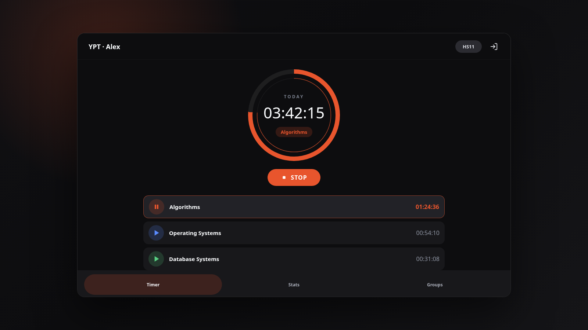

# YPT Desktop Client

Unofficial Flutter desktop client, Flutter web demo, and Next.js landing page
for YPT / 열품타.

[Korean README](README_ko.md)



## About This Fork

This repository is a fork of **[deveworld/ypt_client](https://github.com/deveworld/ypt_client)**
(maintained by [@deveworld](https://github.com/deveworld), originally by Gi Hyeon Sim),
kept at [KingPenguinMan/ypt-desktop](https://github.com/KingPenguinMan/ypt-desktop). All credit for the original
client, the reverse-engineered API layer, and the landing page belongs to the
original author. The upstream project is MIT-licensed; this fork keeps that
license and the original copyright notice — see [LICENSE](LICENSE).

**If you only want the upstream client, use the original repository.**
The fork exists because the additions below were needed for daily desktop use.

### What this fork adds

| Area | Addition |
|---|---|
| **Timer durability** | The running timer is persisted to disk, so killing the process (or a crash) no longer loses the session. On next launch the timer is restored and can be stopped normally — previously the server kept counting while the client had forgotten the session. |
| **System tray** | Tray icon with a live status line (`Subject 1:23:45` / `Not studying · today 4h 9m`), start/stop from the tray, per-subject submenu, hide-to-tray on close, and a real Quit that stops the server-side session first. |
| **History view** | Calendar heat-map of daily study time plus a subject-share donut chart. Both the ring and the legend respond to hover, and clicking pins a subject. |
| **Untimed-gap log** | When you stop the timer and start again, the gap between sessions can be recorded ("what were you doing?"). Gaps under 1 minute are discarded rather than logged, and any entry can be edited later from the History tab. |
| **Windows build pipeline** | `build_and_test.bat` — runs `flutter analyze`, a static self-check, 71 logic assertions, the release build, and packaging, with preflight checks for the C++ toolchain and for an already-running instance. |
| **Static self-check** | `tool/staticcheck.dart` catches duplicate member declarations and unused imports. Needed because this environment cannot run `dart analyze` (it forks a helper process). |
| **Diagnostic logging** | Release builds have no console, so tray/window/gap events are written to `%LOCALAPPDATA%\ypt_client\ypt.log`. Run `open_log.bat` to open it. |
| **Windows build fix** | MSVC reads sources as the system code page; several runner sources are UTF-8 with non-ASCII comments, which failed with `C2220`/`C4819` on Chinese Windows. Fixed by adding `/utf-8` to the runner target. |
| **API notes** | `docs/API_ENDPOINTS.md` (endpoint table) and `docs/DEPENDENCY_API_NOTES.md` (verified third-party package APIs, including several traps). |

### Credentials are not in this repository

The OAuth `clientId` / `clientSecret` values that the upstream project had
hardcoded in `lib/social_auth.dart` were removed. They belong to third parties
and should not be redistributed. They now live in `lib/social_credentials.dart`,
which is **gitignored**; a template is provided at
`lib/social_credentials.example.dart`. See "Build From Source" below.

Note: those values are still present in the upstream repository and in this
repository's earlier history. Removing them from the working tree prevents
further redistribution but does not un-publish them.

## Important Notice

- This project is **unofficial** and is not affiliated with, sponsored by, or
  endorsed by YPT, Pallo Inc., or related rights holders.
- It is intended only for personal-account interop. It is not intended for
  manipulating another account, automation abuse, or study-time fabrication.
- The client talks to YPT's undocumented HTTPS API at `pi.tgclab.com`.
  Behavior can break without warning and may conflict with service terms.
- Email and password are used for the YPT login request. The login JWT is stored
  locally through `shared_preferences`.
- Also, I used Codex (GPT 5.5) for the document part, and got some advice from Claude AI on APK reverse engineering.

## What It Does

YPT Desktop Client lets you use core YPT study flows from a desktop-shaped
interface:

- Email login with local JWT auto-login
- Per-subject study timer start and stop
- Daily study time, subject totals, and category ranking
- Joined groups, browsable groups, and group member activity
- Flutter desktop build targets for Linux, Windows, and macOS
- Flutter web build mounted under the landing page at `/demo/`

## Download From GitHub Releases

Prebuilt desktop assets for **this fork** are attached to
[GitHub Releases](https://github.com/KingPenguinMan/ypt-desktop/releases):

- Linux x64 `.tar.gz` plus `.sha256`
- Windows x64 `.zip` plus `.sha256`
- macOS x64 `.zip` plus `.sha256`

For the upstream project's own releases, see
[deveworld/ypt_client/releases](https://github.com/deveworld/ypt_client/releases).
The two are built from different code — pick whichever matches what you want.

These are packaged Flutter build outputs. The current workflow does not sign or notarize installers.

You may need libwebkit2gtk-4.1-0

## Build From Source

### 1. Provide the OAuth credentials

Social login needs credentials that are **not** committed (see "Credentials are
not in this repository" above). For email/password login you can skip this and
leave the placeholders in place — the app builds either way, and social login
will report that it is not configured.

```bash
cp lib/social_credentials.example.dart lib/social_credentials.dart
# then edit lib/social_credentials.dart and fill in the three values
```

Verify the file is ignored before you commit anything:

```bash
git check-ignore -v lib/social_credentials.dart
```

### 2. Run a development build

```bash
flutter doctor
flutter pub get
flutter run -d linux
```

Build a Linux release locally:

```bash
flutter build linux --release
```

The Linux executable bundle is generated under:

```text
build/linux/x64/release/bundle/
```

### Windows

`build_and_test.bat` runs the whole pipeline (static analysis, static
self-check, logic self-tests, release build, packaging):

```bat
build_and_test.bat
```

It needs the Visual Studio "Desktop development with C++" workload, because
`cnativeapi` (pulled in by `tray_manager`) compiles C++ at build time.
Release builds produce no console output — runtime diagnostics go to
`%LOCALAPPDATA%\ypt_client\ypt.log`, and `open_log.bat` opens that file.

### Other platforms

Desktop builds should be produced on the matching host OS. For cross-platform
release assets, use the GitHub Actions workflow described below.

## Web Demo And Landing

The project has two web surfaces:

- `web/`: Flutter web target for the app demo
- `landing/`: static Next.js landing page

Run the landing page locally:

```bash
cd landing
npm ci
npm run dev
```

Build the static landing page:

```bash
cd landing
npm run build
```

Build the Flutter web demo manually:

```bash
flutter pub get
flutter build web --release --base-href /demo/
```

The GitHub Pages workflow builds both surfaces, copies `build/web/` into
`landing/out/demo/`, and deploys `landing/out`.

## GitHub Actions

### Pages Deploy

`.github/workflows/deploy-web.yml` runs on `main` when these areas change:

- `landing/**`
- `web/**`
- `lib/**`
- `pubspec.yaml`
- `pubspec.lock`
- the deploy workflow itself

The workflow builds `landing/` as a static Next.js export, builds the Flutter
web demo from the root `web/` target, copies `build/web/` into
`landing/out/demo/`, and deploys `landing/out/`.

For project Pages repositories, the workflow uses `/<repo>` as the Next.js base
path and `/<repo>/demo/` as the Flutter web base href. For `*.github.io`
repositories, it uses the domain root and `/demo/`.

### Prebuilt Desktop Release Assets

`.github/workflows/release-desktop.yml` is a manual `workflow_dispatch`
workflow. Give it an existing GitHub Release tag, and it builds/uploads:

- Linux x64 `.tar.gz` plus `.sha256`
- Windows x64 `.zip` plus `.sha256`
- macOS x64 `.zip` plus `.sha256`

The workflow uses OS-specific GitHub-hosted runners. Flutter desktop does not
support building Windows and macOS desktop apps from a Linux host just by
installing another compiler toolchain.

## Project Layout

```text
lib/                       Flutter app source
  app_state.dart           Provider state for auth, timer, stats, groups
  ypt_api.dart             YPT API client
  models.dart              API response models
  screens/                 Login, home, timer, stats, group screens
  history_models.dart      History view models (heat-map bins, pie slices)
  timer_persistence.dart   On-disk snapshot of the running timer
  gap_log.dart             Untimed-gap records (see "About This Fork")
  tray_service.dart        System tray icon, menu, window close behaviour
  app_log.dart             File logger (release builds have no console)
  social_credentials.dart  OAuth credentials — GITIGNORED, not in this repo
  social_credentials.example.dart   Template for the above

tool/                      Standalone Dart scripts (no Flutter dependency)
  selftest.dart            71 pure-logic assertions
  calendartest.dart        Date/heat-map parsing assertions
  staticcheck.dart         Duplicate members + unused imports

docs/                      Reverse-engineering and dependency notes
assets/tray/               Tray icon (white hourglass, transparent)
build_and_test.bat         Windows: analyze + checks + build + package
open_log.bat               Windows: open the runtime log

linux/                     Flutter Linux desktop target
macos/                     Flutter macOS desktop target
windows/                   Flutter Windows desktop target
web/                       Flutter web demo target
landing/                   Next.js static landing page
.github/workflows/         Pages deploy and desktop release workflows
```

## Running the checks

The two assertion suites and the static check are plain Dart and do **not** need
the Flutter SDK or a device:

```bash
dart run tool/selftest.dart        # 71 assertions
dart run tool/calendartest.dart    # date / heat-map parsing
dart run tool/staticcheck.dart     # duplicate members, unused imports
```

Run all of them plus the release build on Windows with `build_and_test.bat`.

## Development Checklist

- Keep undocumented API behavior isolated in `lib/ypt_api.dart`.
- Keep response parsing defensive; the API may change field names or value
  types.
- Run `flutter analyze` before shipping Flutter changes when the Flutter SDK is
  available.
- Run `npm run build` inside `landing/` before shipping landing page changes.
- Run `flutter build web --release --base-href /demo/` before shipping web demo
  changes.

## License

[MIT](LICENSE)
